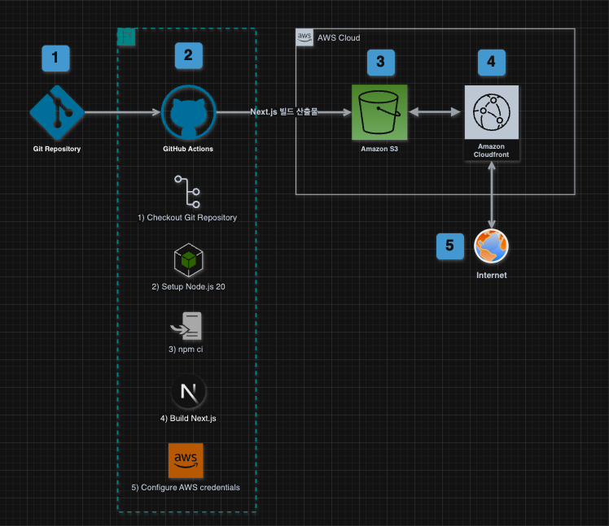

# 프론트엔드 배포 파이프라인 - [기본과제]

## 배포 파이프라인 Diagram

---

## 요구사항

1. 저장소를 체크아웃합니다.
2. Node.js 18.x 버전을 설정합니다.
3. 프로젝트 의존성을 설치합니다.
4. Next.js 프로젝트를 빌드합니다.
5. AWS 자격 증명을 구성합니다.
6. 빌드된 파일을 S3 버킷에 동기화합니다.
7. CloudFront 캐시를 무효화합니다.

## 주요 링크

- S3 버킷 웹사이트 엔드포인트:  
  http://study-my-buket.s3-website-ap-southeast-2.amazonaws.com/
- CloudFront 배포 도메인 이름:  
  https://dlkftduvjrs6r.cloudfront.net

## 주요개념

- GitHub Actions과 CI/CD 도구
  - GitHub Actions는 GitHub에서 제공하는 CI/CD 도구로, 코드 저장소에서 특정 이벤트(예: push, pull request)가 발생했을 때 자동으로 빌드, 테스트, 배포 등의 작업을 수행할 수 있습니다.
    - CI (Continuous Integration)는 코드 변경 시 자동으로 테스트와 빌드를 수행하여 변경 사항이 잘 통합되었는지 확인하는 프로세스입니다.
    - CD (Continuous Deployment/Delivery)는 테스트 및 빌드 완료 후 변경 사항을 자동 또는 수동으로 배포하는 과정을 의미합니다.
- S3와 스토리지
  - Amazon S3 (Simple Storage Service)는 AWS에서 제공하는 객체 스토리지 서비스로, 데이터를 안전하게 저장하고 웹사이트의 정적 파일을 호스팅하는 데 사용됩니다.
  - 빌드 결과를 S3 버킷에 업로드하여 사용자에게 정적 파일로 제공합니다.
- CloudFront와 CDN
  - Amazon CloudFront는 AWS의 콘텐츠 전송 네트워크(CDN) 서비스입니다. 전 세계의 엣지 로케이션을 활용하여 사용자에게 더 빠르게 콘텐츠를 제공할 수 있습니다.
  - S3의 정적 파일을 CloudFront를 통해 사용자에게 전송하여 성능과 안정성을 높입니다.
- 캐시 무효화 (Cache Invalidation)
  - CloudFront 캐시 무효화는 CloudFront 엣지 로케이션에 캐시된 파일이 최신 상태가 아닐 때 이를 무효화하여, S3의 최신 파일을 제공하도록 하는 작업입니다. 캐시 무효화를 통해 웹사이트에 적용된 변경 사항이 사용자의 브라우저에 빠르게 반영될 수 있습니다.
- Repository secret과 환경변수
  - GitHub Secrets는 민감한 정보를 안전하게 저장하고 관리하는 기능으로, AWS 자격 증명이나 API 키와 같은 정보를 포함합니다. 이 정보들은 GitHub Actions 워크플로우에서 참조되어 배포 과정에서 안전하게 사용됩니다.
  - 환경변수는 코드 내에 하드코딩하지 않고 외부 설정 파일이나 환경변수로 관리하여 보안과 유연성을 높이는 방식입니다.

# CDN 도입 전과 도입 후의 성능 개선 - [심화과제]

### 개요

S3 단독 배포 방식은 글로벌 사용자에게 리소스를 전달하는 데 한계가 있을 수 있습니다. 이를 확인하고 해결하기 위해 CloudFront를 도입하여 S3와 연계한 배포 방식을 적용했습니다. 이 과정에서 초기 응답 시간, 리소스 로딩 속도, 파일 크기 최적화 등에서 성능 개선 여부를 구체적으로 측정했습니다. 분석 결과, S3와 CDN 연계를 통해 기술적 이점뿐 아니라 사용자 경험의 체감 로딩 속도도 크게 향상되었습니다.

### 주요 파일별 로딩 시간 개선

| CDN 도입 전 네트워크 요청 | CDN 도입 전 네트워크 요청 |
| ------------------------- | ------------------------- |
|   |   |

| 파일 유형  | CDN 전 | CDN 후 | 개선율 |
| ---------- | ------ | ------ | ------ |
| HTML 문서  | 162ms  | 12ms   | 92.6%  |
| 스타일시트 | 154ms  | 23ms   | 85.0%  |
| 스크립트   | 159ms  | 9ms    | 94.3%  |
| 폰트       | 152ms  | 24ms   | 84.2%  |
| SVG        | 150ms  | 10ms   | 93.3%  |

### 종합 결론

CDN을 통해 평균적으로 85~95% 이상의 성능 개선이 이루어졌습니다. 이러한 최적화는 사용자 경험(UX)을 개선하고 페이지 로딩 속도를 대폭 향상시키는 데 기여했습니다. 특히 HTML 문서와 스크립트 파일에서 가장 높은 개선 효과를 확인할 수 있습니다.
